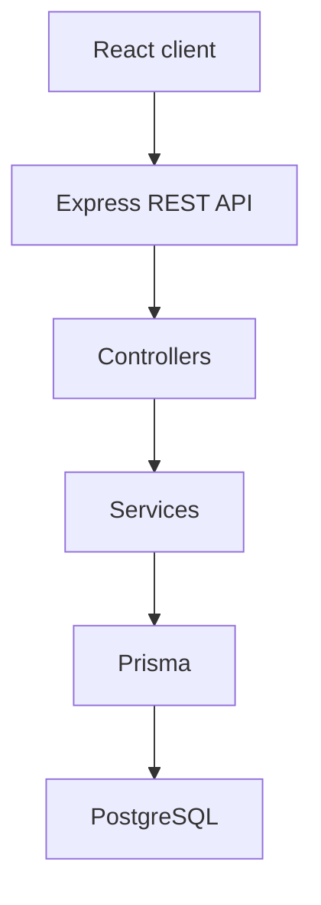

# KaushalSetu

Academia–Industry Collaboration Portal for Smart India Hackathon 2026.

## Problem

There is a persistent gap between the skills students acquire in academic institutions and the competencies industries expect. Students often do not know which skills are in demand, which they are missing, which internships or jobs fit them, or which learning programmes to take. Industries struggle to find candidates with the right skills. Academicians need better access to faculty internships, industrial training, FDPs, consultancy, and research collaboration. Institutions need visibility into skill gaps, internship participation, placement readiness, and outcomes.

## Solution

KaushalSetu is a central portal that connects **students**, **industries**, **academicians**, and **institutions**. Students build a skill profile through assessment, see gaps against industry requirements, receive learning recommendations, and apply to matched opportunities. Industries post internships and jobs with explicit skill requirements and review ranked candidates. Institutions see analytics on readiness and demand.

## Core USP

**Skill Intelligence + Opportunity Matching Engine**

The MVP matching engine is an **explainable mathematical model**, not an LLM or embedding search.

For each required skill:

- If student proficiency ≥ required proficiency → full points
- Otherwise → partial points = student proficiency / required proficiency

`matchPercentage = (earned points / total possible points) × 100`

The API will return match percentage, matched skills, and skill gaps (current, required, gap). That engine is **not implemented in Phase 1**.

## Current status (Phase 1)

Phase 1 is the **foundation only**:

- Project structure (`client/` + `server/`)
- Express API with `GET /api/health`
- Prisma + PostgreSQL configuration and `User` model
- React + Vite + Tailwind design system
- Landing page, login **placeholder**, application **shell**

Not yet implemented: authentication, skill assessment, matching, opportunities, applications, analytics, academician portal, learning programmes, or portfolio.

## MVP modules (planned)

| Module | Phase |
| --- | --- |
| Foundation + UI design system | 1 (this release) |
| Authentication + RBAC | 2 |
| Student profile + skills | 3 |
| Skill assessment + skill intelligence | 4 |
| Industry opportunities | 5 |
| Matching engine | 6 |
| Applications + tracking | 7 |
| Industry candidate ranking | 8 |
| Institution analytics | 9 |
| Learning programmes | 10 (post-MVP) |
| Digital portfolio | 11 |
| Academician portal | 12 |
| Verification | 13 |
| Optional AI resume parsing | 14 |
| SIH polish + deployment | 15 |

## Technology stack

| Layer | Choice |
| --- | --- |
| Frontend | React, JavaScript, Vite, React Router, Tailwind CSS, Axios, Lucide React |
| Backend | Node.js, Express.js, JavaScript, REST |
| Database | PostgreSQL, Prisma ORM 6.x |

Prisma is pinned to **6.x**. Prisma 7+ moved the database URL into a separate config file and requires a driver adapter (`pg` + `@prisma/adapter-pg`). Phase 1 keeps the documented `schema.prisma` + `DATABASE_URL` setup so the stack stays JavaScript-only and beginner-friendly.
| Auth (later) | JWT, bcrypt |

JavaScript only. No TypeScript, MongoDB, Mongoose, NestJS, or microservices for this MVP.

## Architecture

```text
React (Vite)
    ↓ REST (Axios)
Express
    ↓ Controllers
Services
    ↓ Prisma
PostgreSQL
```



Business logic lives in services. Controllers stay thin. Routes do not contain domain rules.

## Project structure

```text
.
├── client/          React + Vite frontend
├── server/          Express API + Prisma
├── .env.example     Environment template
├── README.md
└── LICENSE
```

## Local setup

### 1. Clone the repository

```bash
git clone https://github.com/codedby-jay/kaushalsetu.git
cd kaushalsetu
```

### 2. Install dependencies

```bash
cd server && npm install
npx prisma generate
cd ../client && npm install
```

### 3. Configure environment

Copy `.env.example` to `server/.env` and replace placeholders:

```bash
cp .env.example server/.env
```

Do not commit `.env`. `JWT_SECRET` is reserved for Phase 2 and is unused in Phase 1.

Optional frontend override (`client/.env`):

```bash
VITE_API_URL=/api
```

In development, Vite proxies `/api` to `http://localhost:5000`.

### 4. Start PostgreSQL

Create a database named `kaushalsetu` (or match `DATABASE_URL`).

Phase 1 **does not require** PostgreSQL for the API process to start. If the database is unreachable, `GET /api/health` still returns HTTP 200 with `"database": "down"`.

### 5. Prisma (requires a running PostgreSQL instance)

These commands fail if PostgreSQL is not running or `DATABASE_URL` is wrong. That is expected.

```bash
cd server
npx prisma validate
npx prisma migrate dev --name init_user_foundation
```

`npx prisma generate` does **not** require a live database.

### 6. Start the backend

```bash
cd server
npm run dev
```

API: `http://localhost:5000`  
Health: `http://localhost:5000/api/health`

### 7. Start the frontend

```bash
cd client
npm run dev
```

App: `http://localhost:5173`

## Routes

| Method | Path | Notes |
| --- | --- | --- |
| GET | `/api/health` | Service + database status |
| UI | `/` | Landing page |
| UI | `/login` | Login placeholder (no auth) |
| UI | `/app` | Application shell |

## Development phases

Work proceeds **one phase at a time**. Do not start the next phase until it is explicitly requested.

1. Foundation + UI design system  
2. Authentication + RBAC  
3. Student profile + skills  
4. Skill assessment + skill intelligence  
5. Industry opportunities  
6. Matching engine  
7. Applications + tracking  
8. Industry candidate ranking  
9. Institution analytics  

Post-MVP: learning programmes, digital portfolio, academician portal, verification, optional AI resume parsing, SIH polish.

## License

MIT. See [LICENSE](LICENSE).
