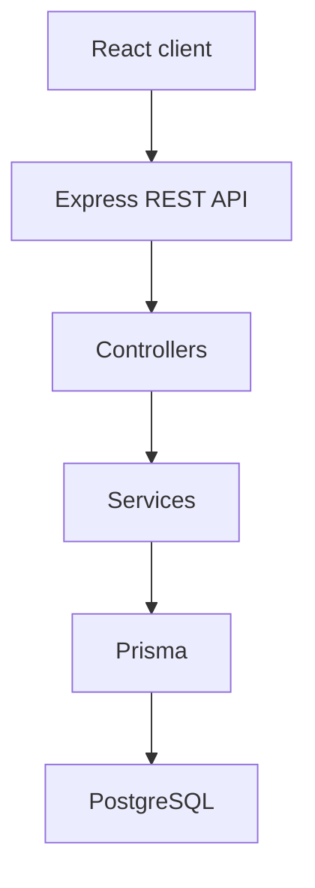

# KaushalSetu

Academia–Industry Collaboration Portal for Smart India Hackathon 2026.

## Problem

There is a persistent gap between the skills students acquire in academic institutions and the competencies industries expect. Students often do not know which skills are in demand, which they are missing, which internships or jobs fit them, or which learning programmes to take. Industries struggle to find candidates with the right skills. Academicians need better access to faculty internships, industrial training, FDPs, consultancy, and research collaboration. Institutions need visibility into skill gaps, internship participation, placement readiness, and outcomes.

## Solution

KaushalSetu is a central portal that connects **students**, **industries**, **academicians**, and **institutions**. Students build a skill profile through assessment, see gaps against industry requirements, receive learning recommendations, and apply to matched opportunities. Industries post internships and jobs with explicit skill requirements and review ranked candidates. Institutions see analytics on readiness and demand.

## Core USP

**Skill Intelligence + Opportunity Matching Engine**

The MVP matching engine is an **explainable mathematical model**, not an LLM or embedding search.

For each opportunity skill, student proficiency **S** is compared with required proficiency **R**. Required skills use weight **1.0**; optional skills use **0.5**.

- If **R = 0**, the skill is fully satisfied (`scoreRatio = 1`)
- Otherwise `scoreRatio = min(S / R, 1)` (missing student records use **S = 0**)

`matchPercentage = round( sum(scoreRatio × weight) / sum(weights) × 100 )`

The API returns match percentage, matched skills, partial skills, skill gaps, and a generated summary.

## Current status (Phase 10)

Completed:

- Foundation, design system, health API (Phase 1)
- Authentication, JWT, RBAC (Phase 2)
- Student profile and skills (Phase 3)
- Skill assessments, scoring, Skill Intelligence, industry readiness (Phase 4)
- Industry company profiles, opportunities, skill requirements, student browse/filter (Phase 5)
- Explainable skill matching (student → published opportunity) (Phase 6)
- Career roles, skill roadmap, and dynamically recommended assessments (Phase 7)
- Student applications, tracking, and industry application status (Phase 8)
- Industry candidate ranking, filtering, and shortlist workflow (Phase 9)
- Role-specific dashboards, registration session, and platform-wide institution analytics (Phase 10)

Successful **registration now returns a JWT and public user** and the client stores that session, then opens `/app`. Passwords are never stored in the browser. Administrator accounts still cannot be created through public registration.

### Dashboards

`/app` is a role-specific workspace backed by live PostgreSQL data (no fake statistics).

- **Student:** career-roadmap Industry Readiness (or “—” with no career goal), skills, applications, explainable matches, Skill Intelligence, and a profile-completion prompt.
- **Industry:** company-scoped pipeline, opportunities, recent applications, and Phase 9 candidate ranking.
- **Institution:** **platform-wide anonymized insights** (see below).
- **Academician:** account + collaboration coming-soon + published industry activity snapshot (no fake KPIs).
- **Admin:** lightweight placeholder. Institution analytics are **not** exposed to ADMIN.

### Institution analytics (important limitation)

There is **no** `InstitutionProfile` and **no** `StudentProfile.institutionId`. Phase 10 does **not** provide “your institution’s students.” INSTITUTION users see **platform-wide aggregated, anonymized** metrics. APIs do not return student names, emails, or profile IDs.

Definitions:

- **Industry Readiness / placement ready:** `calculateMatch()` against the student’s **career role** skills (same engine as the career roadmap). Bands: ≥80 Ready, ≥60 Almost Ready, ≥40 Developing, &lt;40 Needs Attention. Students without an active career goal are **Insufficient Data** and are excluded from the readiness average. Placement/opportunity ready means match ≥ 60%. A career goal with zero skills is 0% / Needs Attention.
- **Skill gaps:** for students with a career goal, gap rate is the share whose `StudentSkill.proficiency` (missing = 0) is below that role’s `CareerRoleSkill.requiredProficiency`.
- **Industry demand:** skills on **PUBLISHED** opportunities only (draft and closed are excluded).
- **Gap vs demand:** deterministic rules (High/Medium/Low demand share vs average proficiency), not AI.

Not yet implemented: learning programmes, digital portfolio, academician collaboration portal, or institution tenancy.

## MVP modules (planned)

| Module | Phase |
| --- | --- |
| Foundation + UI design system | 1 |
| Authentication + RBAC | 2 |
| Student profile + skills | 3 |
| Skill assessment + skill intelligence | 4 |
| Industry opportunities | 5 |
| Matching engine | 6 |
| Career roadmap + dynamic assessments | 7 |
| Applications + tracking | 8 |
| Industry candidate ranking | 9 |
| Institution analytics + dashboards | 10 (this release) |
| Learning programmes | 10 (post-MVP) |
| Digital portfolio | 11 |
| Academician portal | 12 |
| Verification | 13 |
| Optional AI resume parsing | 14 |
| SIH polish + deployment | 15 |

## Technology stack

| Layer | Choice |
| --- | --- |
| Frontend | React, JavaScript, Vite, React Router, Tailwind CSS, Axios, Lucide React |
| Backend | Node.js, Express.js, JavaScript, REST |
| Database | PostgreSQL, Prisma ORM 6.19.3 |
| Auth | JWT (`jsonwebtoken`), bcryptjs |

Prisma is pinned to **6.19.3**. Prisma 7+ moved the database URL into a separate config file and requires a driver adapter. This project keeps `schema.prisma` + `DATABASE_URL`.

JavaScript only. No TypeScript, MongoDB, Mongoose, NestJS, or microservices for this MVP.

## Architecture

```text
React (Vite)
    ↓ REST (Axios)
Express
    ↓ Controllers
Services
    ↓ Prisma
PostgreSQL
```



Business logic lives in services. Controllers stay thin. Routes do not contain domain rules.

## Project structure

```text
.
├── client/          React + Vite frontend
├── server/          Express API + Prisma
├── .env.example     Environment template
├── README.md
└── LICENSE
```

## Local setup

### 1. Clone the repository

```bash
git clone https://github.com/codedby-jay/kaushalsetu.git
cd kaushalsetu
```

### 2. Install dependencies

```bash
cd server && npm install
npx prisma generate
cd ../client && npm install
```

### 3. Configure environment

Copy `.env.example` to `server/.env` and replace placeholders:

```bash
cp .env.example server/.env
```

Do not commit `.env`. Set a long random `JWT_SECRET` before using login. Public registration cannot create `ADMIN` accounts.

Optional frontend override (`client/.env`):

```bash
VITE_API_URL=/api
```

In development, Vite proxies `/api` to `http://localhost:5000`.

### 4. Start PostgreSQL

Create a database named `kaushalsetu` (or match `DATABASE_URL`).

Phase 1 **does not require** PostgreSQL for the API process to start. If the database is unreachable, `GET /api/health` still returns HTTP 200 with `"database": "down"`.

### 5. Prisma (requires a running PostgreSQL instance)

The repository includes a committed migration history:

1. `init_user_foundation` — Phase 1 schema
2. `add_authentication` — `User.name` and default role `STUDENT`
3. `add_student_profile_and_skills` — Phase 3
4. `add_skill_assessment_system` — Phase 4
5. `add_industry_opportunities` — Phase 5

If you already created a local `kaushalsetu` database during Phase 1 (no git migration history), treat it as disposable and recreate it:

```bash
dropdb kaushalsetu
createdb kaushalsetu
cd server
npx prisma validate
npx prisma migrate dev
npx prisma generate
npx prisma db seed
```

On Linux/macOS with `psql` instead of `dropdb`/`createdb`:

```bash
psql -d postgres -c "DROP DATABASE IF EXISTS kaushalsetu;"
psql -d postgres -c "CREATE DATABASE kaushalsetu;"
```

Do **not** use `prisma db push`. Fresh clones should use `npx prisma migrate dev` (local) or `npx prisma migrate deploy` (apply existing migrations only).

Existing databases should apply Phase 5 with `npx prisma migrate deploy` (do not `migrate reset`). Seed is idempotent and creates demo industry accounts only when those emails are missing:

- `industry.abc@kaushalsetu.demo` / `KaushalSetu@2026` — ABC Technologies
- `industry.nova@kaushalsetu.demo` / `KaushalSetu@2026` — Nova Software
- `student.a@kaushalsetu.demo` / `KaushalSetu@2026` — Ananya Sharma
- `student.b@kaushalsetu.demo` / `KaushalSetu@2026` — Karthik Iyer
- `student.c@kaushalsetu.demo` / `KaushalSetu@2026` — Jay Prajapati

Seed also creates demo applications on ABC and Nova listings so industry candidate ranking can be reviewed without extra setup. Existing passwords for those emails are never overwritten.

`npx prisma generate` does **not** require a live database, but it does need `DATABASE_URL` to be set.

### 6. Start the backend

```bash
cd server
npm run dev
```

API: `http://localhost:5000`  
Health: `http://localhost:5000/api/health`

### 7. Start the frontend

```bash
cd client
npm run dev
```

App: `http://localhost:5173`

## Routes

| Method | Path | Notes |
| --- | --- | --- |
| GET | `/api/health` | Service + database status |
| POST | `/api/auth/register` | Public registration (no ADMIN); returns JWT + user |
| POST | `/api/auth/login` | Returns JWT + user |
| GET | `/api/auth/me` | Current user (Bearer token) |
| GET | `/api/auth/student-only` | RBAC demo: STUDENT 200, others 403 |
| GET | `/api/student/profile` | Own student profile (STUDENT) |
| POST | `/api/student/profile` | Create profile |
| PUT | `/api/student/profile` | Update profile |
| DELETE | `/api/student/profile` | Delete profile (not the User) |
| GET | `/api/student/skills` | Own skills + summary |
| POST | `/api/student/skills` | Add skill |
| PUT | `/api/student/skills/:skillId` | Update proficiency |
| DELETE | `/api/student/skills/:skillId` | Remove skill |
| GET | `/api/skills` | Skill catalog (authenticated) |
| GET | `/api/assessments` | Active assessments (STUDENT) |
| GET | `/api/assessments/:id` | Questions without correct answers |
| POST | `/api/assessments/:id/start` | Start or resume attempt |
| POST | `/api/assessments/:id/submit` | Score and update skills |
| GET | `/api/student/assessments/history` | Own attempts |
| GET | `/api/student/assessment-results/:attemptId` | Result + intelligence |
| GET | `/api/student/skill-intelligence` | Latest per-skill intelligence |
| GET | `/api/student/dashboard` | Student workspace (STUDENT) |
| GET | `/api/industry/dashboard` | Company-scoped workspace (INDUSTRY) |
| GET | `/api/institution/dashboard` | Platform-wide anonymized analytics (INSTITUTION) |
| GET | `/api/academician/dashboard` | Lightweight academician workspace |
| UI | `/` | Landing page |
| UI | `/register` | Registration |
| UI | `/login` | Sign in |
| UI | `/app` | Role-specific dashboard |
| UI | `/app/profile` | Student profile (STUDENT) |
| UI | `/app/skills` | Student skills (STUDENT) |
| UI | `/app/assessments` | Assessment list |
| UI | `/app/assessments/:id` | Take assessment |
| UI | `/app/assessments/results/:attemptId` | Result |
| POST | `/api/opportunities/:id/apply` | Student apply (STUDENT, published only) |
| GET | `/api/student/applications` | Own applications |
| GET | `/api/student/applications/:id` | Own application detail |
| PATCH | `/api/student/applications/:id/withdraw` | Withdraw eligible application |
| GET | `/api/industry/opportunities/:id/applications` | Ranked applicants for owned listing (`sort`, `status`, `search`, `minMatch`) |
| GET | `/api/industry/applications/:id` | Owned application detail |
| PATCH | `/api/industry/applications/:id/status` | Valid industry status transition |
| UI | `/app/applications` | Student applications |
| UI | `/app/applications/:id` | Student application detail |
| UI | `/app/opportunities/:id/apply` | Apply form |
| UI | `/app/candidates` | Industry candidate hub (owned opportunities) |
| UI | `/app/opportunities/:id/applications` | Ranked industry applicant list |
| UI | `/app/industry/applications/:id` | Industry application review |

## Development phases

Work proceeds **one phase at a time**. Do not start the next phase until it is explicitly requested.

1. Foundation + UI design system  
2. Authentication + RBAC  
3. Student profile + skills  
4. Skill assessment + skill intelligence  
5. Industry opportunities  
6. Matching engine  
7. Career roadmap + dynamic assessments  
8. Applications + tracking  
9. Industry candidate ranking  
10. Institution analytics + dashboards (this release)  

Post-MVP: learning programmes, digital portfolio, academician portal, verification, optional AI resume parsing, SIH polish.

## License

MIT. See [LICENSE](LICENSE).
